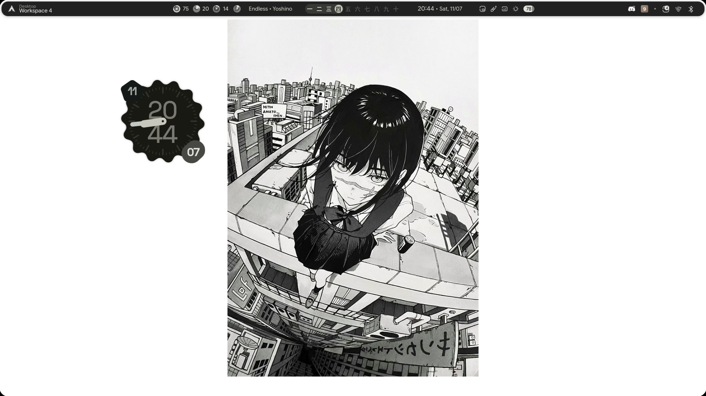

# 🌧️ Raindots

> **⚠️ Work in progress.** This project is under active development. Things may break, change, or be incomplete. Use at your own risk.



Personal Hyprland dotfiles blending three upstream projects into a cohesive desktop experience. The repo is the single source of truth — deployment is one-way via symlinks (repo → `~/.config/`).

Built on:

- **[end-4/dots-hyprland](https://github.com/end-4/dots-hyprland)** — Lua-based Hyprland config (environment, keybinds, rules, execs, colors, shell overrides)
- **[neur0map/ryoku-arch](https://github.com/neur0map/ryoku-arch)** — Quickshell settings hub with theme management, cursor control, Hyprland appearance/input tuning
- **[magetsu002/qs-wallpaper-picker](https://github.com/magetsu002/qs-wallpaper-picker)** — Full wallpaper picker GUI with image/video support, matugen theming, and smooth transitions

---

## Features

- **Lua-driven Hyprland** — modular config split into one-concern-per-file under `rain/config/hypr/hyprland/`, with a `custom/` overlay for machine-specific overrides
- **Quickshell shell** — named config (`rain`) with 50+ services (Audio, Battery, Network, Notifications, AI, Clipboard, Updates, Wallpapers, etc.)
- **Settings hub** — QML-based GUI (`rain hub`) for live-tuning Hyprland appearance, input, cursor themes, layouts, and keybinds
- **Wallpaper picker** — browse local wallpapers with live preview, video wallpaper support (mpvpaper), smooth animated transitions (awww), optional matugen dynamic theming
- **Pill bar** — workspaces with scrollable app icons, active window title, clock, media (MPRIS), battery, resources, system tray, weather, keyboard layout, notification badge, screen corners
- **Sidebar system** — left sidebar (AI chat, anime/booru, translator) and right sidebar (control center, calendar, notifications, pomodoro, todo, volume, bluetooth, wifi)
- **Overlay system** — on-screen keyboard, OSD (volume/brightness), media controls popup, notification popup, session/power screen, app/search overview
- **Rain CLI** — Go binary for workspace switching, wallpaper control, shell launch/kill/reload, IPC dispatch to QML modules

---

## Structure

```
raindots/
├── bin/dev               # dev workflow: up|check|hyprland|shell|logs|kill
├── install.sh            # create symlinks: rain/config/* → ~/.config/*
├── rain/
│   ├── config/
│   │   ├── hypr/               # → ~/.config/hypr
│   │   │   ├── custom/         # user overrides (not overwritten)
│   │   │   ├── hyprland/       # Lua modules (env, keybinds, rules, execs, etc.)
│   │   │   ├── hypridle.conf
│   │   │   ├── hyprlock.conf
│   │   │   └── hyprland.lua    # entry point
│   │   └── quickshell/
│   │       └── rain/           # named config: quickshell -c rain
│   │           ├── shell.qml           # ShellRoot entry point
│   │           ├── Singletons/         # Config, Theme, Directories, Events, etc.
│   │           ├── services/           # 50 services (Audio, Battery, Network, etc.)
│   │           ├── panelFamilies/      # Lazy-loaded panel families (ii-style)
│   │           ├── modules/ii/         # 21 module directories (bar, lock, sidebars, etc.)
│   │           ├── assets/             # Fluent UI SVGs, wallpapers
│   │           ├── scripts/            # Helper scripts (wallpaper, colors, keyring)
│   │           └── translations/       # i18n JSON files
│   ├── cli/                # Rain CLI (Go)
│   │   ├── main.go         # IPC dispatch, shell management
│   │   └── hub.go          # Hub backend (themes, cursors, Hyprland settings)
│   └── bin/                # → ~/.config/rain/bin (rain binary)
├── references/             # Read-only upstream references
│   ├── dots-hyprland/
│   ├── ii/
│   └── ryoku-arch/
└── docs/                   # Personal notes
```

**Key pattern:** Symlinks, not copies. `install.sh` backs up existing dirs, then `ln -sfn` from `rain/config/*` to `~/.config/*`. Edit in the repo — changes are live.

---

## Requirements

| Tool | Purpose |
|---|---|
| Hyprland | Compositor |
| Quickshell | QML shell environment |
| awww | Image wallpaper transitions |
| mpvpaper | Video wallpapers |
| Go (optional) | Building rain CLI from source |
| matugen (optional) | Dynamic color theming |

---

## Installation

```bash
# Local clone
git clone https://github.com/josumaru/raindots.git
cd raindots
./install.sh

# Or via curl (no manual clone needed)
curl -fsSL https://raw.githubusercontent.com/josumaru/raindots/main/install.sh | bash
```

This creates symlinks:
- `~/.config/hypr` → `rain/config/hypr`
- `~/.config/quickshell` → `rain/config/quickshell`

Add the CLI to your `PATH`:
```bash
export PATH="$PATH:$HOME/.config/rain/bin"
```

---

## Usage

### Development workflow

```
bin/dev up              # Re-symlink all configs + rebuild rain CLI
bin/dev check           # Verify symlink status
bin/dev hyprland        # Launch Hyprland with repo config
bin/dev shell           # Launch quickshell rain
bin/dev shell rain -vv  # Launch with verbose logging
bin/dev logs -f         # Follow quickshell logs
bin/dev kill            # Kill quickshell instances
```

### Rain CLI

```
rain shell              Launch quickshell rain
rain shell kill         Kill quickshell
rain shell reload       Kill quickshell (reloads next launch)
rain workspace <n>      Switch to workspace
rain wallpaper <path>   Set wallpaper via awww
rain lock               Lock screen (hyprlock)
rain hub                Launch settings hub
rain hub hypr themes    List themes
rain hub hypr theme     Apply a theme
rain hub hypr scheme    Set colour source (follow|light|dark)
rain hub hypr cursors   List cursor themes
rain hyprctl <args>     Run hyprctl
rain log                Follow quickshell logs
```

**Shell IPC commands** (dispatch to QML modules):

| Command | Effect |
|---|---|
| `rain sidebar` | Toggle right sidebar (control center) |
| `rain sidebarleft` | Toggle left sidebar (AI/booru/translator) |
| `rain search` | Toggle app/search overview |
| `rain cheatsheet` | Toggle keybind cheatsheet |
| `rain media` | Toggle media controls popup |
| `rain overlay` | Toggle widget overlay |
| `rain screenshot` | Region screenshot |
| `rain translator` | Screen translator |
| `rain session` | Toggle session/power screen |
| `rain wallpaperpicker` | Toggle full wallpaper picker |
| `rain wallpaperselector` | Toggle lightweight wallpaper browser |
| `rain osk` | Toggle on-screen keyboard |
| `rain osd` | Trigger volume OSD |
| `rain bartoggle` | Toggle bar visibility |
| `rain ipc <target> <fn>` | Raw Quickshell IPC call |

---

## Customisation

### Hyprland overrides

Place machine-specific configs in `rain/config/hypr/custom/` — they are loaded after base modules and won't be overwritten by base updates:

```
custom/env.lua       # Environment variables
custom/execs.lua     # Autostart programs
custom/general.lua   # General settings
custom/rules.lua     # Window rules
custom/keybinds.lua  # Keybinds
```

### Settings hub

Launch `rain hub` to adjust gaps, borders, rounding, blur, opacity, input settings, keyboard layout, cursor theme, and more. Changes persist across restarts.

### Adding a panel family

Create `panelFamilies/FooFamily.qml` and add a `PanelFamilyLoader` in `shell.qml`:

```qml
PanelFamilyLoader {
    identifier: "foo"
    component: FooFamily {}
}
```

---

## Credits

- **[end-4/dots-hyprland](https://github.com/end-4/dots-hyprland)** — Modular Lua Hyprland configuration with shell overrides, scripts, and keybinding conventions
- **[neur0map/ryoku-arch](https://github.com/neur0map/ryoku-arch)** — Quickshell-based settings hub with theme/palette management, cursor browsing, and Hyprland config backend
- **[magetsu002/qs-wallpaper-picker](https://github.com/magetsu002/qs-wallpaper-picker)** — Full-featured wallpaper picker for Quickshell with image/video support, matugen integration, and animated transitions
- **ii project** (reference) — Pill bar, module system, and QML shell architecture

---

## License

MIT — see [LICENSE](LICENSE) for details. Upstream components retain their original licenses.
